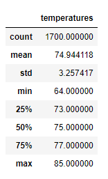
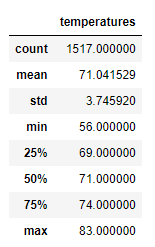

# Surfs Up!

## Overview of the Statistical Analysis (Or how to solve the "Should Have Been Here Yesterday Syndrome").

### W. Avy wishes to create a business on the island of O'ahu and wants to see the weather conditions based around his peak business months of June and December which can affect ice cream sales, surfboard rentals, or both.  To accomplish this weather data was pulled and sorted on the June and December time-frame for all the available years in the data set.  Below are the findings.

## Results (Or "Is it Possible to do a Cheater's Five While Eating a Cone of Double Toffee Crunch").

### First, let's inspect the June time-frame weather.

### Temperature for June:

### As can be seen the temperature in June is very stable with only two degrees of difference in one standard deviation with the maximum and minimum temperatures only ranging roughly 10 degrees from the mean of 75 degrees (F) which should provide ideal conditions for both ice cream sales and surf board rentals.

### Temperature for December:

### The December season yeilds a slightly different perspective.  While there are only two to three degrees of temperature swing within one standard deviation of the mean the mean is lower than in June (June's 75 degree (F) to December's 71 (F)) this may discourage ice cream sales and with minimums of 56 degrees some days may see no sales of ice cream and the colder temperatures may discourage surfboard rentals as well.  In December temperature swings toward cold days can be as bad as 15 degrees.

## Summary

### Days in June are moderate and should see decent sales receipts in both areas if weather is in indication of demand.  December has more troublesome days that may affect demand for ice cream but in general should still be decent for surfboard rentals.

### As as side note other factors should be considered in this analysis as wave conditions are more likely to drive rentals than temperature.  Typically winter provides better surfing conditions than summer and this may drive sales despite temperature.  Also it is not impossible to paddle out with an cone of double toffee crunch but it is unlikely to be eating this during a cutback. 

